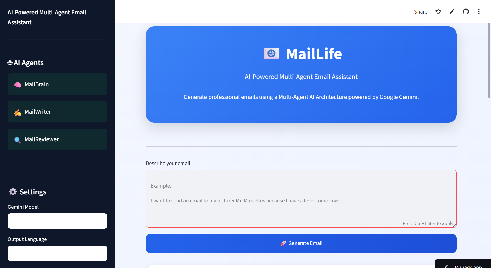
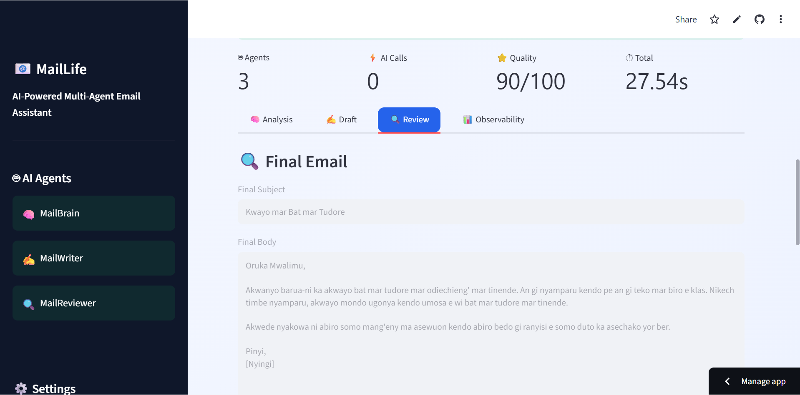

<div align="center">

# 📧 MailLife

### AI-Powered Multi-Agent Email Assistant

Generate professional, context-aware emails using an intelligent **Multi-Agent AI Workflow** powered by **Google Gemini**.

[]()
[]()
[]()
[]()

### 🌐 Live Demo

**https://maillife.streamlit.app**

*"Don't just generate emails. Let AI think before it writes."*

</div>

---

# 📸 Preview

## 🏠 Home

<p align="center">

</p>

---

## 📧 Final Generated Email

<p align="center">

</p>

---

# 🚀 Overview

MailLife is an AI-powered email assistant built using a **Multi-Agent Architecture**.

Instead of relying on a single LLM prompt, MailLife divides the workflow into specialized AI agents.

Each agent focuses on a single responsibility:

- 🧠 Understand the user's request
- ✍ Generate a professional email
- 🔍 Review and improve the result
- 📊 Record execution metrics

This approach produces emails that are **more accurate, professional, and reliable** than a traditional single-prompt workflow.

---

# ✨ Key Features

| Feature | Description |
|---------|-------------|
| 🧠 MailBrain | Analyze intent, recipient, language, and tone |
| ✍ MailWriter | Generate professional email drafts |
| 🔍 MailReviewer | Improve grammar, clarity, and professionalism |
| 📊 Observability | Monitor AI calls and execution time |
| 📥 Export | Download email as TXT or JSON |
| 🎨 Modern UI | Beautiful dashboard built with Streamlit |

---

# 🏗 Multi-Agent Workflow

```text
                    User Request
                          │
                          ▼
                 🧠 MailBrain Agent
               Analyze & Understand
                          │
                          ▼
                ✍ MailWriter Agent
             Generate Email Draft
                          │
                          ▼
               🔍 MailReviewer Agent
          Review & Improve Draft
                          │
                          ▼
                 📊 Observability
                          │
                          ▼
                   Final Email
```

---

# ⚙ How It Works

```text
User Input
      │
      ▼
MailBrain analyzes the request
      │
      ▼
MailWriter creates the email draft
      │
      ▼
MailReviewer enhances the quality
      │
      ▼
Observability records execution
      │
      ▼
Download Final Email
```

---

# 📂 Project Structure

```text
MailLife
│
├── agents/
│   ├── planner.py
│   ├── writer.py
│   └── reviewer.py
│
├── core/
│   ├── gemini_client.py
│   └── orchestrator.py
│
├── prompts/
│
├── ui/
│   ├── components.py
│   ├── sidebar.py
│   ├── styles.py
│   └── timeline.py
│
├── utils/
│
├── assets/
│   ├── home.png
│   └── final.png
│
├── streamlit_app.py
├── requirements.txt
└── README.md
```

---

# 🛠 Installation

Clone the repository

```bash
git clone https://github.com/Reinerbroww/MailLife.git
```

Move into the project

```bash
cd MailLife
```

Install dependencies

```bash
pip install -r requirements.txt
```

Create a `.env` file

```env
GEMINI_API_KEY=YOUR_API_KEY
```

Run the application

```bash
streamlit run streamlit_app.py
```

---

# 💻 Technology Stack

- 🐍 Python
- 🎨 Streamlit
- 🤖 Google Gemini API
- 📦 python-dotenv
- 🧠 Multi-Agent Architecture

---

# 🎯 Roadmap

- ✅ Multi-Agent Workflow
- ✅ Professional UI
- ✅ Live Deployment
- ✅ TXT Export
- ✅ JSON Export
- 🔜 Gmail Integration
- 🔜 PDF Export
- 🔜 Email History
- 🔜 Authentication
- 🔜 Cloud Database

---

# 👨‍💻 Author

### Reiner Sakunab

AI & Software Developer

- 🌐 GitHub: https://github.com/Reinerbroww
- 💼 LinkedIn: *(Add your LinkedIn here)*

---

<div align="center">

## ⭐ Star this repository if you found it useful!

Made with ❤️ using **Python**, **Streamlit**, and **Google Gemini**

</div>